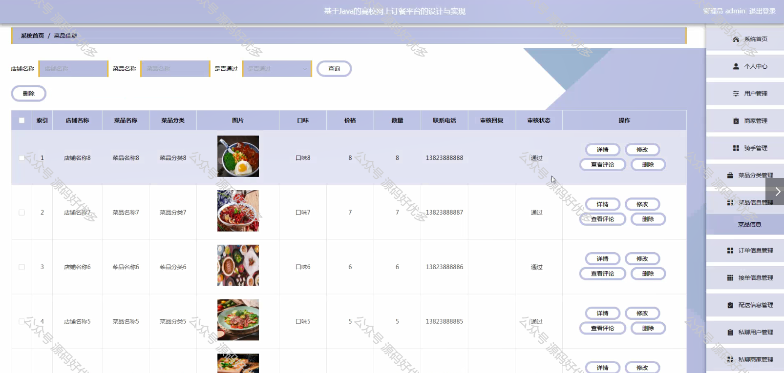
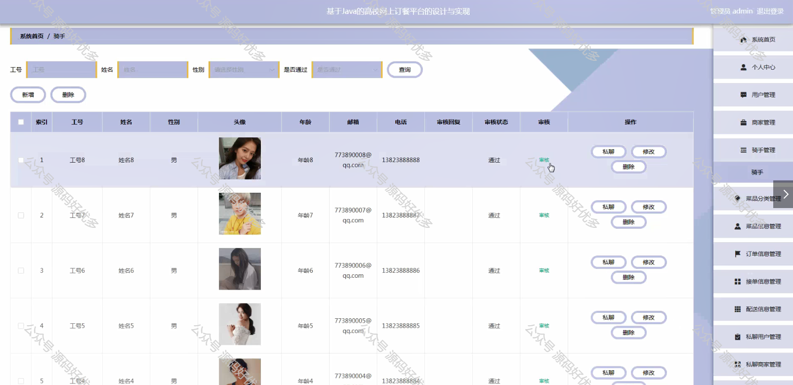

 
## 查看主页获取源码

### 一、作品包含

源码+数据库+设计文档万字+PPT+全套环境和工具资源+部署教程

### 二、项目技术

前端技术：Html、Css、Js、Vue、Element-ui

数据库：MySQL

后端技术：Java、Spring Boot、MyBatis

  

### 三、运行环境

开发工具：IDEA/eclipse

数据库：MySQL5.7

数据库管理工具：Navicat10以上版本

环境配置软件： JDK1.8+Maven3.6.3

前端Nodejs：14

### 四、项目介绍
项目编号：springbootA256

高校网上订餐平台的出现，是高校后勤服务现代化和信息化进程中的一个重要标志。它顺应了当代大学生的生活习惯和需求，通过线上订餐的方式，为高校师生提供了一个便捷、快速、多样化的餐饮服务。这一平台不仅满足了学生对个性化、多元化餐饮的需求，也提高了食堂和外卖服务的效率，减轻了高峰时段的就餐压力。同时，它还为校园周边的餐饮商家提供了一个新的销售渠道，促进了校园商业生态的繁荣。因此，高校网上订餐平台在提升校园生活质量、优化资源配置方面发挥着重要作用。

前台用户功能：浏览首页、菜品信息、公告资讯、留言反馈、后台管理、个人中心。

后台分为管理员、用户、商家、骑手
管理员的功能：系统首页、个人中心、用户管理、商家管理、骑手管理、菜品分类管理、菜品信息管理、订单信息管理、接单信息管理、配送信息管理、私聊用户管理、私聊商家管理、私聊骑手管理、留言反馈、系统管理。
用户的功能：系统首页、个人中心、订单信息管理、配送信息管理和私聊用户管理。
商家的功能：系统首页、个人中心、菜品信息管理、订单信息管理、接单信息管理、配送信息管理、私聊商家管理。
骑手的功能：系统首页、个人中心、订单信息管理、接单信息管理、配送信息管理和私聊骑手管理。

### 五、运行截图

  
